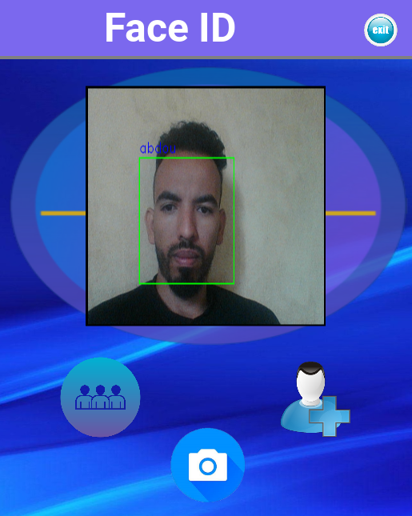

cette application est dediée pour les smartphones pour la reconnaissance faciale 

## Nouvelle application Android (dossier `mobile/`)

Application Flutter de reconnaissance faciale, entièrement hors ligne :

- **Scanner** un visage (caméra ou galerie) → fiche de la personne, « À vérifier » ou **INCONNU**.
- **Enregistrer** une personne : nom, fonction/classe, description et jusqu'à 3 photos.
- Détection des visages : Google ML Kit. Reconnaissance : MobileFaceNet (TFLite, licence BSD-3, issu de MCarlomagno/FaceRecognitionAuth).
- Données stockées localement (SQLite + photos dans le stockage de l'application).

L'APK est compilé automatiquement par GitHub Actions (`.github/workflows/android-apk.yml`) et publié en pré-version sur la page *Releases* du dépôt.

Développement local : `cd mobile && flutter pub get && flutter run`.
